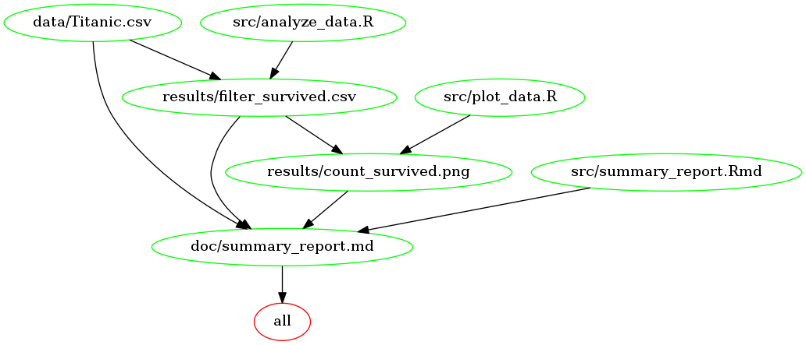

# Analysis On Titanic Survivorship   
    
## Overview      
     
The project is designed to analyze if passenger class played a role in survivorship of Titanic.    
    
#### Indentify Dataset
    
This analysis accesses the dataset of [`Titanic`](https://raw.github.ubc.ca/ubc-mds-2017/datasets/master/data/titanic.csv?token=AAADoFSBnbVYwdHdFU7NfKU4wKwjWIJYks5aP_9ZwA%3D%3D) from the list of [MDS datasets](https://github.ubc.ca/ubc-mds-2017/datasets). This file contains data for 1310 of the real Titanic passengers. The columns describe different attributes about the person including whether they survived, their passenger class, age, sex, the fare they paid and so on. Passenger class (`pclass`) and survivorship (`survived`) are used to conduct the analysis.

#### Hypothesis      
    
My hypothesis is more passengers in the first class survived than those in the second and third classes because the rich have high social status and enjoy lots of privileges at that time. 
 
#### Result    
    
The result of this analysis confirms that passager class played a part in survivorship. However, this effect is not very significant as I thought before. One possible explanation could be that preference was given to women and children in lower classes.    
 

## Usage     
   
To run this analyis, clone this repository, navigate to the project's root directory and follow methods as stated below:
   
#### Run the analysis using Docker    

1. Use launchpad/Finder/Start menu/etc to find and launch Docker.     

2. Open command line (terminal/GitBash) and type 
`docker pull yvonnedy/milestone_project`, verify that the Docker image successfully pulled locally.          
     
3. Then enter the following commands to run the analysis using Docker:    
`docker run --rm -v <LOCAL PATH TO THE PROJECT REPO>:/home/milestone_project yvonnedy/milestone_project make -C '/home/milestone_project' clean
`   
`docker run --rm -v <LOCAL PATH TO THE PROJECT REPO>:/home/milestone_project yvonnedy/milestone_project make -C '/home/milestone_project'
`
                              
#### Run the analysis using Make    
    
1. After navigating to the project's root direcoty, open command line       (terminal/GitBash) and type `make clean` to clean up intermediate files generated in the previous run.         

2. Type `make all` to run the full analysis.     
     
   
## Dependencies 
     
This project was developed under the following condition:    
    
```
R version 3.4.1 (2017-06-30)
```      
   
Dependencies for this project:   
   
- ggplot2 2.2.1     
- purrr   0.2.4
- tibble  1.3.4     
- dplyr   0.7.4
- tidyr   0.7.2     
- stringr 1.2.0
- readr   1.1.1     
- forcats 0.2.0
     
#### Dependency Diagram of The Makefile       
   

        