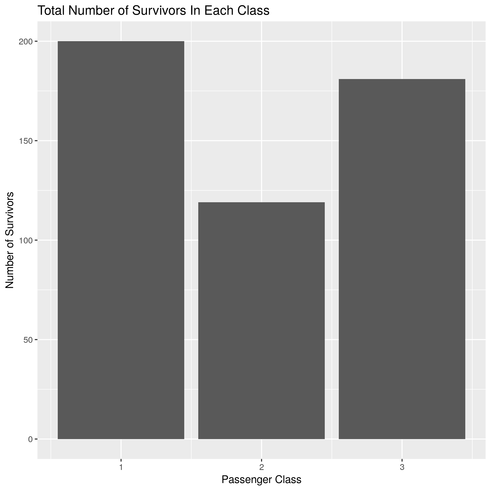

      
```{r setup, include=FALSE}
knitr::opts_chunk$set(echo = TRUE)
```
      
# Summary Report    
    
The project is designed to analyze if passenger class played a role in survivorship of Titanic.  
             
## Original Data

```{r}
original <- read.csv("data/Titanic.csv")
head(original)
```
     
The original dataset contains data for 1310 of the real Titanic passengers. The columns describe different attributes about the person including whether they survived, their passenger class, age, sex, the fare they paid and so on. Passenger class (`pclass`) and survivorship (`survived`) are used to conduct the analysis.
         
## Filtered Data

```{r}
filtered <- read.csv("results/filter_survived.csv")
head(filtered)
```
    
This filtered dataset includes all survived people together with their attributes for each passager class.       
## Figure   
    
 
     
## Conclusion        

The result of this analysis confirms that passager class played a part in survivorship. However, this effect is not very significant as I thought before. One possible explanation could be that preference was given to women and children in lower classes.
         